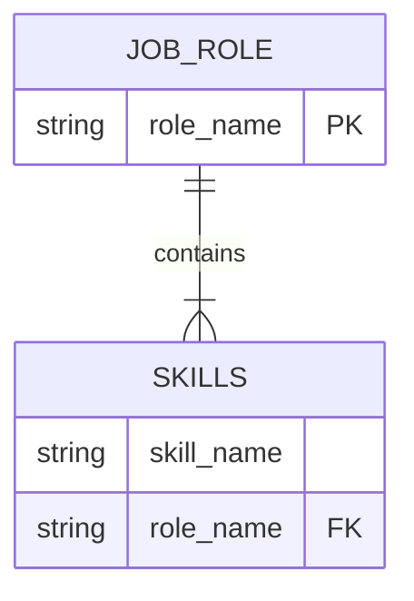
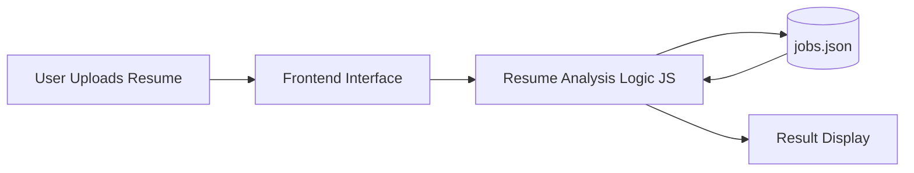

# Slide 2: Project Introduction

**What is the AI Resume Analyzer?**  
This project is a web-based application that analyzes a resume (.txt file) and suggests the best job role based on skills.

**Key Features:**
- Automatically extracts and compares skills.
- **Matched Skills:** Shows which required skills the candidate possesses.
- **Missing Skills:** Highlights areas for improvement to help the candidate upskill.

---
# Slide 3: Data Modeling 

Our system uses a structured JSON format (`jobs.json`) to store the logic. 

**Entity 1: Job Role**  
- `role_name` (e.g., Frontend Developer)
- `skills` (List of required skills: HTML, CSS, JavaScript)

**Entity 2: Resume (Input Data)**  
- `resume_text` (The raw text extracted from the uploaded file)

**How it works:**  
Job roles and skills are stored locally in `jobs.json`. Resume data is read using the JavaScript `FileReader` API and directly compared with the stored skills to calculate a match score.

**Data Structure Example:**
```json
Job Role:
- role_name
- skills[]
```

---
# Slide 4: ER Diagram 

This Entity-Relationship diagram represents how our local data is structured, demonstrating a One-to-Many relationship where one Job Role contains multiple Skills.



---
# Slide 5: Architecture Diagram

This diagram shows the system flow from user interaction to final result display.



**Flow Explanation:**
1. **User uploads resume** via the browser.
2. **JavaScript reads resume** text.
3. **Skills are matched** with the data inside `jobs.json`.
4. **Best role is displayed** based on the highest match score.

---
# Slide 6: Frontend Technology

**Technologies Used:**
- **HTML:** Provides the structure of the web page.
- **CSS:** Handles the UI design, clean layouts, and styling.
- **JavaScript:** Powers the resume reading and skill matching logic.

**Core UI Components:**
- Drag & Drop File Upload.
- Loader Animation for processing feedback.
- Interactive Result Display card.

---
# Slide 7: Backend Technology

**Wait, where is the backend server?**  
This project **does not** use a separate backend server or database (like SQL or MongoDB).

**Instead:**
- `jobs.json` is used as local data storage.
- JavaScript performs all the data processing directly inside the browser.

**Why?**  
Using a Local JSON file works like a simple, lightweight database, making the application fast, secure (no data leaves the browser), and easy to host anywhere.

---
# Slide 8: Live Project Workflow

**Step-by-Step Flow:**
1. Upload Resume (`.txt`).
2. Click **Analyze** Button.
3. Resume text is read using `FileReader`.
4. Extracted text is matched against skills.
5. Match score is calculated `(Matched / Total) * 100`.
6. Best matching role is displayed.
7. Missing skills are shown as learning recommendations.

---
# Slide 9: Thank You Slide

**Thank You**  

*(Any Questions?)*
