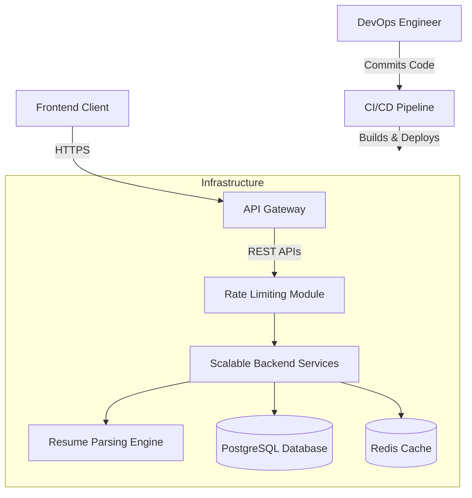

# System Architecture & Design: AI Resume Analyzer

This document outlines the architectural blueprint for upgrading the AI Resume Analyzer from a simple standalone script to an enterprise-grade, highly available application.

---

## 1. Persona and User Experience

Before defining the technical components, we must understand the primary **persona** driving this application:
- **The Job Seeker Persona**: Needs fast, accurate feedback on their resume against current industry standards. They expect a seamless, modern **UI UX** that provides clear, actionable recommendations (missing skills) without a complex onboarding process.

The application's **UI UX** must reflect these needs through a responsive, centered design that minimizes friction from file upload to analysis.

---

## 2. Architecture Diagram

The system follows a modern decoupled architecture, separating the client interface from the processing logic.



---

## 3. Frontend Architecture

The frontend will be a Single Page Application (SPA) utilizing modern JavaScript frameworks (like React or Vue). 

- **Focus**: Delivering an exceptional **UI UX** with drag-and-drop file uploads, real-time feedback, and accessible result cards.
- **Integration**: The frontend communicates with the server via standard HTTP methods consuming the backend's exposed **REST APIs**.

---

## 4. Backend Architecture

To handle high traffic and complex text-processing tasks, we will implement a **scalable backend** (e.g., using Node.js with Express or Python with FastAPI).

### Key Backend Features:
- **REST APIs**: A structured routing system exposing endpoints like `POST /api/analyze` and `GET /api/jobs`.
- **Swagger Documentation**: All **REST APIs** will be documented using **Swagger** (OpenAPI specification) to provide developers and API consumers with an interactive interface for testing and integration.
- **Rate Limiting**: To prevent abuse and ensure high availability, **rate limiting** will be implemented at the API Gateway level (e.g., maximum 100 requests per IP per hour).

---

## 5. Data Modeling

Our database will store structured information about the available roles and past analysis history to improve recommendations over time.

### Entity Relationships

**Job Role Model**
```json
{
  "id": "uuid",
  "title": "Frontend Developer",
  "required_skills": ["HTML", "CSS", "JavaScript", "React"],
  "created_at": "timestamp"
}
```

**User Analysis Report Model**
```json
{
  "id": "uuid",
  "user_id": "uuid (optional)",
  "uploaded_file_name": "resume.txt",
  "matched_role_id": "uuid (Job Role Model)",
  "match_score": 85,
  "missing_skills": ["TypeScript", "Tailwind"],
  "analyzed_at": "timestamp"
}
```

---

## 6. Infrastructure and Operations

To ensure the application is reliable and easy to deploy across different environments, we will employ modern DevOps practices.

- **Dockerization**: The entire application stack (Frontend, Backend, Database) will be containerized. **Dockerization** ensures environmental consistency ("it works on my machine") and simplifies horizontal scaling.
- **CI/CD Pipeline**: We will set up a robust **CI/CD pipeline** (using GitHub Actions or Jenkins). This pipeline will automatically run unit tests, build Docker images, and deploy updates to the production server whenever new code is merged, ensuring zero downtime and continuous delivery.
